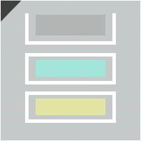

# **daikumi_editor**  

  

 

  

dakumi_editor是由qwws所制作的tamumi3的饭制谱面编辑器！

[dakumi_editor](https://github.com/qwwshs/daikumi_editor/tree/main) 
---

## 使用的注意事项

- 在使用前请切换英文输入法

- 在进入谱面编辑前 请一定要新建谱面!!!
- offset的单位为ms

- bpm的beat分为三个数值 第一个是beat的整数数值 第二个是beat细分的分数的分母 第三个是beat细分的分数的分子

- x w的范围为0-100

- 谱面会保存到love2d的文件夹内 点击按钮open_chart_list能打开

---

## 使用教程

### 选择界面
#### 导入
|文件类型|方式|注意事项|
|----|----|----|
|歌曲|拖入dakumi_editor的窗口中|后缀应为wav;mp3;ogg且后缀必须正确 不然 __dakumi_editor会报错__ |
|谱面|选择到该谱面的歌曲然后拖入窗口|可以导入.mc的slide或key谱面|
|曲绘|选择到该谱面的歌曲然后拖入窗口|后缀应为jpg;jpeg;png且后缀必须正确 不然 __dakumi_editor会报错__|

#### 按钮

选择界面分为多个按钮 位于左边的按钮都是对谱面相关的编辑 其余的按钮放在了右边

- 左边按钮依次为edit; delete; new chart

|按钮|功能|注意事项|
|----|----|----|
|edit|进入编辑模式|需要dakumi editor有歌曲 如果在无谱面的情况下进入edit将不能保存|
|delete|删除当前谱面|需要有谱面才能删除 且确认删除后无法恢复|
|new chart|新建一个空白的谱面|需要dakumi editor有歌曲|
- 右边按钮依次为export;delete music;open file selector;open chart list

|按钮|功能|注意事项|
|----|----|----|
|export|导出谱面为zip|需要有歌曲|
|delete music|删除歌曲|需要有歌曲|
|open file selector|打开dakumi内置的文件选择器|可以选择文件导入 效果和拖动文件到窗口相同|
|open chart list|打开dakumi_editor的存档文件夹|无|
## 编辑界面

编辑界面中细分了几个区域 分别是工具栏 侧边栏 play区域 edit区域
### 工具栏

工具栏位于编辑界面上方 包含了一些常用的功能

|按钮|功能|对应的快捷键|图标|
|----|----|----|----|
|play/pause|播放当前谱面/停止播放|空格键||
|save|保存|ctrl+s||
|denom|改变节拍细分|up/down键||
|track|改变当前轨道|right/left键||
|scale|改变当前轨道缩放|无||
|fence|改变当前play区域栅栏数|无||
|music_speed|改变当前播放速度|无||

### edit区域

edit区域位于play区域的右方侧边栏的左方 没有任何按钮
- 从左到右的三个轨道分别是note轨道 x轨道 w轨道 以下称为第一 二 三 轨道
- 以下称事件为event

|操作|方法|注意事项|
|----|----|----|
|放置note/wipe/hold|鼠标指针停留在一轨上按下q/w/e键 放置hold尾部时需要再次按下e|无法重叠放置 且hold尾部beat应该大于hold头部beat|
|放置event|鼠标指针停留在二/三轨上按下e键 放置尾部时需要再次按下e|无法重叠放置 且event尾部beat应该大于event头部beat|
|删除note/event|鼠标指针停留在note/事件上按下d键|无|
|选中note/event|左键单击选择|无|
|往复制表里添加/删除该note/event|右键单击选择/删除|无|
|修改note/event beat|选中note/event后按下alt＋z改变头部beat 类型为hold/event时可以按下alt+x改变尾部beat|无|
|裁剪event|选中event后按下alt+c|裁剪后的event长度为当前beat细分的1/2|

### play区域
- 点击play区域的轨道会将当前轨道切换到该轨道 如果多个轨道叠在一起 再次按下可以切换到下一个轨道
- 编辑区域无法编辑event 其余编辑方法与edit区域相同

### 批量操作
- 按住左键会出现复制框 在左键松开之前按下shift会移除复制表中的所有内容 然后添加为现在框选的内容

- 如果并非按下ctrl＋x 被框选到的note/event会标记蓝色 按下ctrl+x后会标记成白色
- 在edit区域选中的内容操作后生成的新内容会改变为当前轨道或ctrl+n所新键的轨道 play区域除了ctrl+n外不会改变轨道
- 右键单击note/event会将该其加入复制表

以下操作均需要复制框有内容才会发生

|操作|方式|注意事项|
|----|----|----|
|批量删除note/event|ctrl+d|无|
|复制|ctrl+c|无|
|裁剪|ctrl+x|裁剪后标记会变为白色|
|粘贴|ctrl+v|裁剪后的粘贴会删除掉裁剪的内容 如果选中的内容是在play中选中的 则粘贴后不粘贴event|
|粘贴 镜像x事件|ctrl+b|裁剪后的粘贴会删除掉裁剪的内容 如果选中的内容是在play中选中的 则粘贴后不粘贴event|
|粘贴|ctrl+a+v|裁剪后的粘贴会删除掉裁剪的内容 会粘贴play的event|
|粘贴 镜像x事件|ctrl+a+b|裁剪后的粘贴会删除掉裁剪的内容 会粘贴play的event|
|轨道快速创建|ctrl+n|会依据当前在鼠标所在play的x位置来更改粘贴后event的内容 并且会粘贴到一条新轨道上|
|轨道快速批量创建|ctrl+a+n|会依据当前在鼠标所在play的x位置来更改粘贴后event的内容 并且会粘贴多条新轨道上|

### demo_mode
- 你可以按下tab进入demo_mode 再次按下退出

## 侧边栏

- 侧边栏有chart info;settings;tracks_edit;to github按钮

|名称|中文名称|作用|
|----|----|----|
|chart info|谱面信息|可以书写谱面信息|
|settings|设置|可以更改设置|
|tracks_edit|多轨编辑|按下后会进入到多轨道编辑模式|
|to github|去github|点击后会打开dakumi_editor的github仓库|

- __还有一些 需要特定操作触发的界面__

|名称|中文名称|触发|
|----|----|----|
|eventx|事件x|单击event|
|notex|notex|单击note|
|notex|notex|单击note|
|multiple_events_edit|多事件编辑|粘贴表选中到event|

- ___因为大部分页面都很清楚 这里只解释部分界面___

### tracks_edit
- 进入后会自动进入多轨编辑模式 按下esc键会退出 在侧边栏下有add和sub按钮 按下后会添加新的轨道或删除当前选中输入框的轨道

- 在多轨编辑模式中按下left/right键会将当前所有轨道向左/右平移

### multiple_events_edit
- 扰动会使event的数字增加/减少在-扰动值到+扰动值范围内的随机数

- 从（from）到（to）会赋予选中事件的初始值到结束值的数（数大小遵循trans）

- trans 是form to的过渡

- trans 有三种类型bezier easing function

- type 为bezier时 string应为bezier的点坐标  例如 bezier 0,0,1,1  第奇数个数字代表这个点的x坐标 第偶数个数字代表这个点的y坐标

- type 为easing时 string应为数字或是easing的名称 例如 easing 1 或是 easing in_circ 其中当string为easing的名称时 因全部字母小写且每个单词用_隔开

- type 为function时 string因该为function表达式 函数的传入值为 x 例如 function 1/x 其中x大于等于0 x小于等于1 比如sin这样的函数调用时因该遵循lua的语法

## 自定义
- 打击音 请将打击音的前缀改为hit_sound 然后拖入到dakumi_editor的窗口中

- note皮肤 请将图片素材的前缀改成以下的名称并通过open chart list打开dakumi_editor的ui文件夹后导入 所使用的图片大小最好相同

| note类型 |  图片名称 |
|----|----|
| note | ui_note.png |
| hold头 | ui_hold_head.png |
| hold身 | ui_hold_body.png |
| hold尾 | ui_hold_tail.png |
| wipe | ui_wipe.png |
---
## **关于**
相关库

- [LxgwNeoXiHei](https://github.com/lxgw/LxgwNeoXiHei)

- [love2d](https://github.com/love2d/love)

- [dkjson](https://github.com/LuaDist/dkjson)
